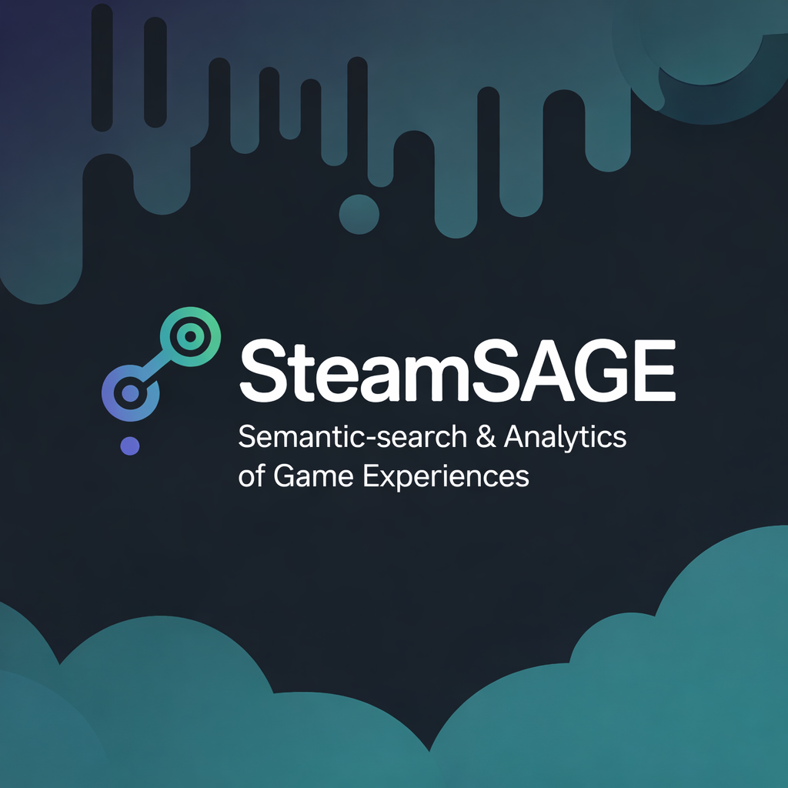
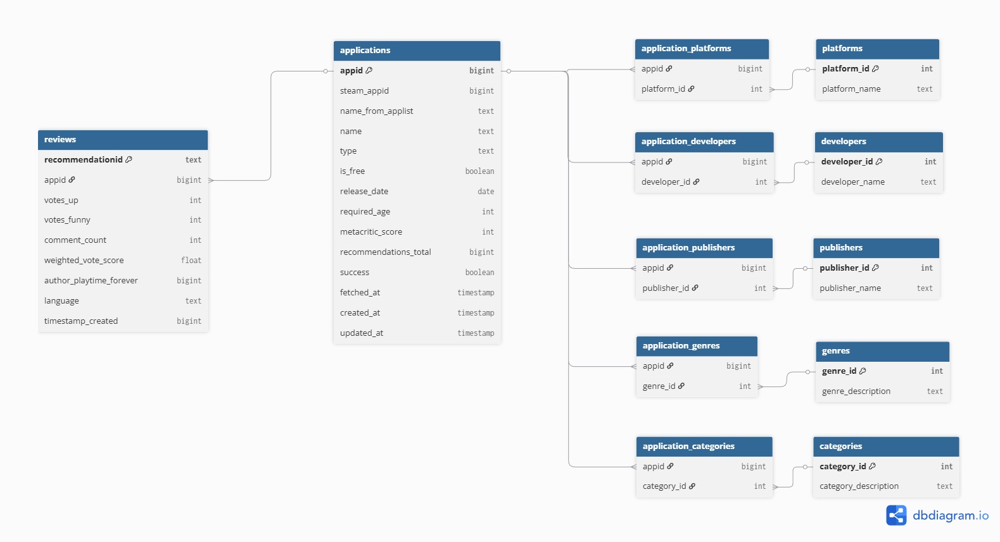
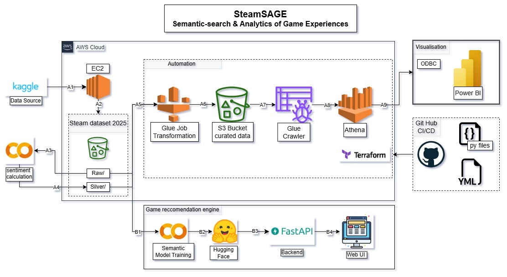
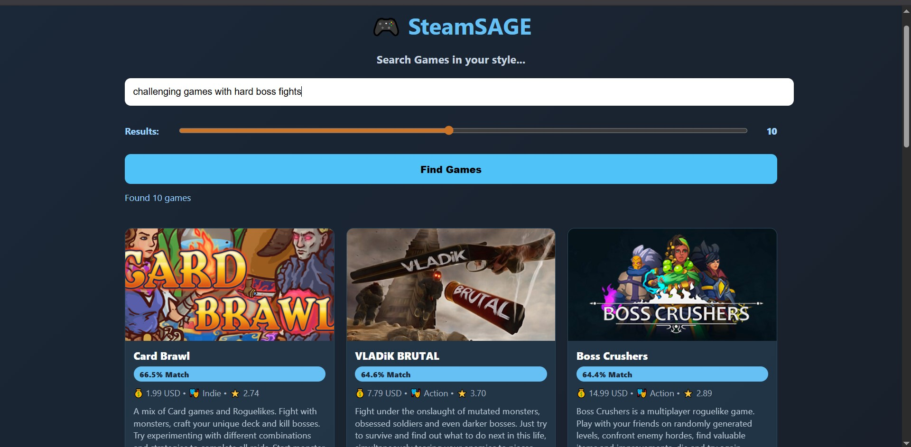

# 🎮 SteamSAGE – Steam: Semantic-Search and Analytics of Game Experiences

> **SteamSAGE** is a big data analytics and semantic search platform built on data of Steam Platform. It combines advanced analytics, and NLP-powered semantic-search to understand *how games are priced, reviewed, and experienced by players*.

---

## 🚀 Motivation

Steam hosts **hundreds of thousands of games** and **millions of player reviews**, but raw data alone does not answer critical questions:

- Why do some games succeed while others fail?
- How do pricing, genres, platforms, and developers influence player sentiment?
- Can we search games *by meaning*, not just keywords?

**SteamSAGE** was built to bridge this gap by unifying:

- 🔍 **Semantic Search** over games and reviews
- 📊 **Business & product analytics**
- ⚙️ **Cloud-scale data engineering**

---

## ❓ Problem Statement

Steam data is:

- Massive (millions of rows)
- Highly relational (many-to-many relationships)
- Semi-structured (JSON fields, text reviews)
- Poorly suited for traditional analytics without heavy transformation

As a result:

- Developers struggle to extract insights from reviews
- Analysts lack a clean, analytics-ready schema
- Keyword search fails to capture *intent* and *experience*

👉 **SteamSAGE solves this by designing a clean analytical model, scalable pipelines, and semantic embeddings to unlock deeper insights.**

---

## 🧱 Raw Database Architecture

The raw dataset closely mirrors the Steam API structure and contains deeply nested and normalized entities.

**Key characteristics:**

- Raw CSV ingestion
- Highly normalized
- JSON-heavy fields (prices, requirements, ratings)
- Not suitable for BI or ML directly

---

## 🧩 Clean Database Architecture

The clean layer makes the data ready for **Analytics and ML**.

---

## 🏗️ Project Architecture

SteamSAGE is designed as a **cloud-native analytics and AI solution**.

### Architecture Overview

1. **Data Source**

   - Steam Dataset 2025 (Kaggle)

2. **Storage**

   - Amazon S3

3. **Processing**

   - AWS Glue

4. **Semantic Layer**

   - Sentence Transformers (Game description)

5. **Analytics & Visualization**

   - Power BI dashboards

6. **Serving**

   - Hugging Face based semantic search app

---

## 📊 Power BI Analytics

SteamSAGE includes rich interactive dashboards covering:

- Game distribution by platform
- Free vs Paid games analysis
- Pricing vs engagement
- Top genres, developers, publishers
- Metacritic score distributions
- Review engagement trends

## 🔍 Semantic Search Model (Live Demo)

We built a **working semantic search engine** and deployed on Hugging Face.

### 🔗 Live Model

👉 **[SteamSAGE Semantic Search Website ](https://steamsage.vercel.app/)**

### 📸 Model Screenshot

**Capabilities:**

- Search games by *meaning*, not keywords
- Query using natural language
- Retrieve semantically similar games & reviews score

---

## 🧠 Key Learnings

- Raw Steam data is not analytics-ready without some transformation
- Outliers skew gaming metrics
- Semantic embeddings unlock insights impossible with SQL alone
- BI + NLP together provide *context + explanation*

---

## 🔮 Future Enhancements

- Real-time ingestion & streaming analytics
- Game Success Predictor

---

